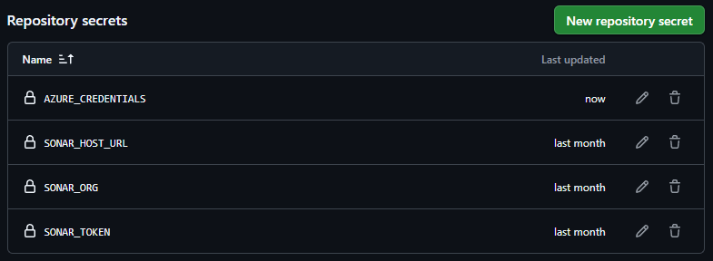
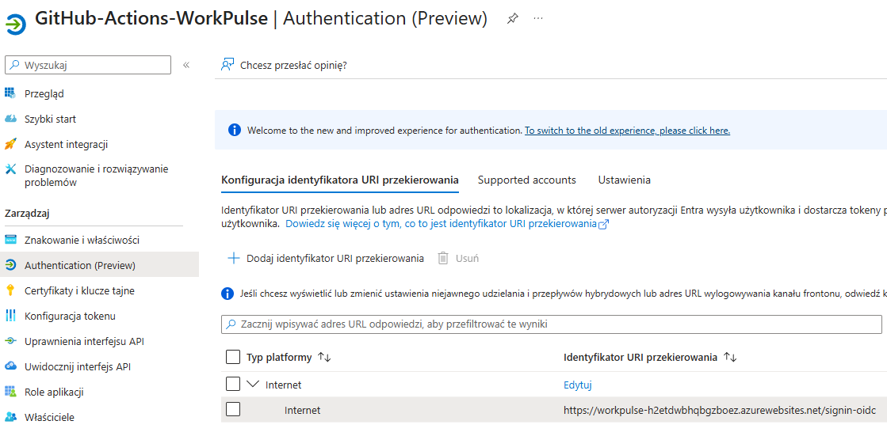
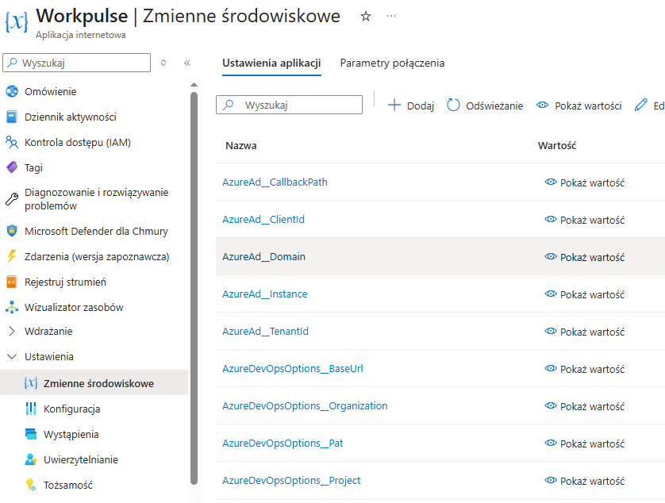

# WorkPulse – Task & Infrastructure Monitoring Dashboard

WorkPulse is an integrated admin platform built with Blazor (.NET 8). It combines Azure DevOps project management with SSL certificate monitoring and real-time host diagnostics. Access security is handled via Microsoft Entra ID integration.

---

## Problems it solves

**1. Centralized task management (Azure DevOps)**
Integrates Azure Boards WorkItems into a single lightweight interface — no need to open the full Azure DevOps portal to view, create, or edit tasks.

**2. Secure corporate access (Entra ID)**
Solves the user authorization problem by integrating with Microsoft Entra ID (Azure AD), ensuring that only authorized organization members can access diagnostic data and tasks.

**3. Automated SSL certificate monitoring**
A built-in Background Service continuously monitors certificate expiry dates and generates alerts, preventing service outages caused by expired certificates.

**4. Infrastructure visibility and diagnostics**
Provides insight into host system parameters (RAM, uptime, processes) directly in the browser — no need to log into the server via RDP/SSH for basic diagnostics.

---

## Key features

| Module | Description |
|---|---|
| **Entra ID Authentication** | Secure login using modern authentication |
| **Azure WorkItem Manager** | Full Azure DevOps API integration for task lifecycle management |
| **Certificate Watcher** | Autonomous background service tracking critical SSL certificate deadlines |
| **Live System Stream** | Interactive panel displaying a real-time host diagnostic log stream |

---

## Configuration (`appsettings.json`)

Before running the app locally, fill in `appsettings.json` with your organization and Azure app registration details:

```json
{
  "Logging": {
    "LogLevel": {
      "Default": "Information",
      "Microsoft.AspNetCore": "Warning"
    }
  },
  "AzureDevOpsOptions": {
    "Organization": "YOUR_ORGANIZATION",
    "Project": "YOUR_PROJECT",
    "SupportedTypes": ["Task", "User Story"],
    "DefaultType": "Task",
    "Pat": "YOUR_PERSONAL_ACCESS_TOKEN",
    "BaseUrl": "https://dev.azure.com/",
    "EntitlementsBaseUrl": "https://vsaex.dev.azure.com/"
  },
  "AzureAd": {
    "Instance": "https://login.microsoftonline.com/",
    "Domain": "YOUR_DOMAIN.onmicrosoft.com",
    "TenantId": "YOUR_TENANT_ID",
    "ClientId": "YOUR_CLIENT_ID",
    "CallbackPath": "/signin-oidc"
  },
  "AllowedHosts": "*"
}
```

> **Note:** In the deployed environment, these values are not stored in `appsettings.json`. They are configured as Azure App Service environment variables instead (see [Azure Environment Variables](#4-azure-environment-variables) below).

---

## Deployment (CI/CD via GitHub Actions + OIDC)

The application is deployed to **Azure App Service** using GitHub Actions. Authentication between GitHub and Azure uses **OIDC (OpenID Connect)** — no long-lived secrets are stored. The pipeline publishes the build artifact directly to App Service.

### 1. Create a Service Principal

Run the following command to create a service principal with Contributor access scoped to your App Service:

```bash
az ad sp create-for-rbac --name "GitHub-Actions-WorkPulse" --role contributor \
    --scopes /subscriptions/{your-subscription-id}/resourceGroups/{your-resource-group}/providers/Microsoft.Web/sites/workpulse-h2etdwbhqbgzboez \
    --sdk-auth
```

Copy the full JSON output — you will need it in the next step.

### 2. Add GitHub Repository Secrets

In your repository go to **Settings → Secrets and variables → Actions** and add the following secrets:

| Secret name | Value |
|---|---|
| `AZURE_CREDENTIALS` | The full JSON output from the `az ad sp create-for-rbac` command above |
| `SONAR_HOST_URL` | SonarCloud host URL |
| `SONAR_ORG` | SonarCloud organization key |
| `SONAR_TOKEN` | SonarCloud authentication token |



### 3. Configure Redirect URI in Entra ID

After the first deployment, register the App Service URL as a redirect URI in your Entra ID app registration:

1. Go to **Microsoft Entra ID → App registrations → your app → Authentication**.
2. Under **Redirect URIs**, add:
   ```
   https://{your-app-service-name}.azurewebsites.net/signin-oidc
   ```



### 4. Azure Environment Variables

Configure the following environment variables in **Azure Portal → App Service → Settings → Environment variables**:

| Variable name | Description |
|---|---|
| `AzureAd__CallbackPath` | `/signin-oidc` |
| `AzureAd__ClientId` | Your Entra ID app Client ID |
| `AzureAd__Domain` | Your tenant domain (e.g. `contoso.onmicrosoft.com`) |
| `AzureAd__Instance` | `https://login.microsoftonline.com/` |
| `AzureAd__TenantId` | Your Entra ID Tenant ID |
| `AzureDevOpsOptions__BaseUrl` | `https://dev.azure.com/` |
| `AzureDevOpsOptions__Organization` | Your Azure DevOps organization name |
| `AzureDevOpsOptions__Pat` | Your Personal Access Token |
| `AzureDevOpsOptions__Project` | Your Azure DevOps project name |

> **Note:** Azure App Service maps double-underscore `__` in variable names to the nested JSON structure of `appsettings.json` (e.g. `AzureAd__ClientId` → `AzureAd:ClientId`).



---

## Getting started (local)

1. Clone the repository to your local machine.
2. Open a terminal in the solution root folder.
3. Fill in `appsettings.json` as shown above.
4. Restore dependencies:
   ```bash
   dotnet restore
   ```
5. Run the application:
   ```bash
   dotnet run --project WorkPulse
   ```
6. Open the URL shown in the terminal and sign in with your organization account.